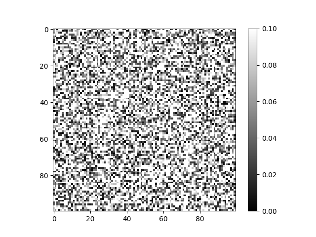
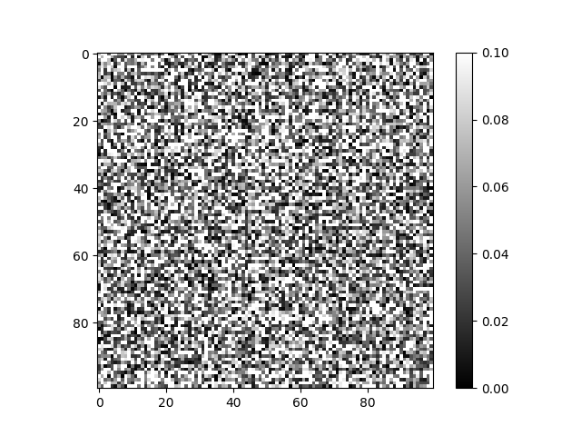
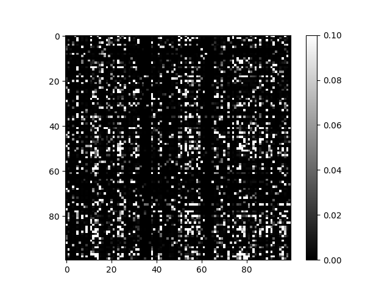
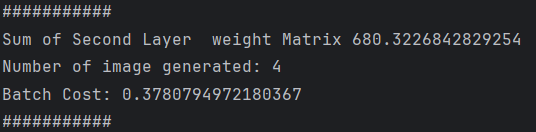

# MNIST Neural Network with L1, L2, and No Regularization

## Table of Contents

- [Overview](#overview)
- [Disclaimer](#disclaimer)
- [Key Features](#key-features)
- [Project Structure](#project-structure)
- [Technologies Used](#technologies-used)
- [Dataset](#dataset)
- [Setup Instructions](#setup-instructions)
- [Screenshots](#screenshots)
- [My Role / What I Learned](#my-role--what-i-learned)
- [License](#license)

## Disclaimer

This project was developed as part of my personal learning. While I may have consulted various educational resources (such as tutorials, documentation, blog posts, or videos) during its creation, I do not recall all specific sources. All code has been independently written and reflects my own understanding of the topic unless explicitly stated. Any resemblance to existing material is unintentional or stems from common practices in the field.

Finally, I would also like to acknowledge that ChatGPT was used to help teach concepts and used to help debug code. When used it was used in a teaching capacity.

## Overview

This project investigates how different regularization strategies—L1, L2, and none—affect the learning dynamics of a simple feedforward neural network trained on the MNIST dataset. All components are implemented manually using NumPy, with a focus on the training loop, backpropagation, and visualizing the effects of regularization on weight matrices.

## Key Features

- Manual implementation of dense layers and MSE cost function
- Training using L1, L2, and no regularization for comparative analysis
- Visualization of weight magnitudes for deeper insight into regularization effects
- Modular architecture to toggle between different modes

## Project Structure

| Folder              | Description                                                                          |
|---------------------|--------------------------------------------------------------------------------------|
| ActivationFunctions | Contains activation function implementations such as Sigmoid and Tanh                |
| DataProcessing      | Responsible for loading and managing the MNIST dataset                               |
| DataSets            | Stores CSV-formatted versions of MNIST dataset for training/testing                  |
| ExcelForTesting     | Contains Excel files used for debugging and unit test verification                   |
| Graphing            | Includes utilities for dynamically plotting metrics (e.g., loss curves) **Not used** |
| Layers              | Core neural network layers: `DenseLayer`, `MSECostLayer`                             |
| PerformanceTests    | Scripts for running networks with L1, L2, or no regularization                       |
| UnitTests           | Modules to verify correctness of layer operations and training components            |
| WeightImages        | Stores output visualizations of layer weights for comparison                         |

## Technologies Used

| Tool        | Purpose                       |
|-------------|-------------------------------|
| Python      | Core programming language     |
| NumPy       | Efficient matrix calculations |
| Matplotlib  | Visualization of training data|

## Dataset

This project uses a reduced version of the **MNIST** dataset in CSV format. Originally sourced from:

> [MNIST in CSV on Kaggle](https://www.kaggle.com/datasets/oddrationale/mnist-in-csv)  
> Provided by: [oddrationale](https://www.kaggle.com/oddrationale)  
> License: Public Domain

Only the training set (`mnist_train.csv`) is used, reduced to 50,000 examples for performance.

## Setup Instructions

```bash
# 1. Clone this repository
git clone https://github.com/jhughes266/Regularization.git
cd Regularization

# 2. Install required packages
pip install numpy matplotlib

# 3. Run one of the performance test scripts:

#    - Without regularization
python PerformanceTests/MnistWithoutReg.py

#    - With L1 regularization
python PerformanceTests/MnistWithL1.py

#    - With L2 regularization
python PerformanceTests/MnistWithL2.py
```

## Screenshots

Each script prints training progress and saves grayscale heatmaps of weight matrices in:

- `WeightImages/NoReg/` for no regularization
- `WeightImages/L1/` for L1 regularization
- `WeightImages/L2/` for L2 regularization

Each file is named by training batch number and shows absolute values of weights in the second dense layer.

Below is some examples of the weight matrices for the different regularization techniques after training.

| No Regularization               | L2 Regularization         | L1 Regularization         |
|---------------------------------|---------------------------|---------------------------|
|  |  |  |
(Notice how the more aggressive the regularization technique the sparser the weight matrix)

In addition to this an example of the console output is given below.
 
The "Sum of Second Layer weight Matrix" gives the sum of the save weight matrix. The "Number of the image generated" is the number of the image that has been generated. The "Batch Cost" is the cost of batch associated with the image generated.  
## My Role / What I Learned

- Implemented dense layers and MSE cost function manually  
- Integrated L1 and L2 regularization into weight updates  
- Created scripts for comparing regularization techniques  
- Visualized internal changes in weight values during training  

## License

MIT License

Copyright (c) 2025 Jotham Hughes

Permission is hereby granted, free of charge, to any person obtaining a copy
of this software and associated documentation files (the “Software”), to deal
in the Software without restriction, including without limitation the rights  
to use, copy, modify, merge, publish, distribute, sublicense, and/or sell  
copies of the Software, and to permit persons to whom the Software is  
furnished to do so, subject to the following conditions:

The above copyright notice and this permission notice shall be included in  
all copies or substantial portions of the Software.

THE SOFTWARE IS PROVIDED “AS IS”, WITHOUT WARRANTY OF ANY KIND, EXPRESS OR  
IMPLIED, INCLUDING BUT NOT LIMITED TO THE WARRANTIES OF MERCHANTABILITY,  
FITNESS FOR A PARTICULAR PURPOSE AND NONINFRINGEMENT. IN NO EVENT SHALL THE  
AUTHORS OR COPYRIGHT HOLDERS BE LIABLE FOR ANY CLAIM, DAMAGES OR OTHER  
LIABILITY, WHETHER IN AN ACTION OF CONTRACT, TORT OR OTHERWISE, ARISING  
FROM, OUT OF OR IN CONNECTION WITH THE SOFTWARE OR THE USE OR OTHER DEALINGS  
IN THE SOFTWARE.
